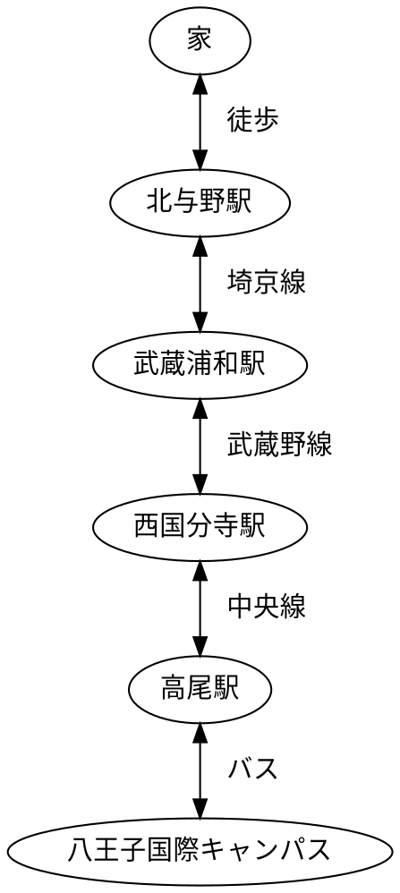

# 高浜の通学経路

[メンバー表に戻る](member.md#メンバー表)

```graphviz
digraph {
    edge [dir=both]
    家 -> 北与野駅 [label=　徒歩]
    北与野駅 -> 武蔵浦和駅 [label=　埼京線]
    武蔵浦和駅 -> 西国分寺駅 [label=　武蔵野線]
    西国分寺駅 -> 高尾駅 [label=　中央線]
    高尾駅 -> 八王子国際キャンパス [label=　バス]
}
```